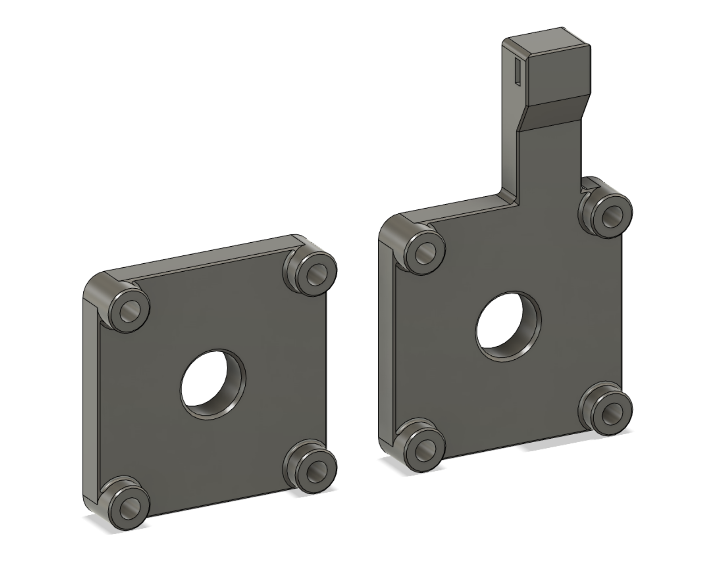
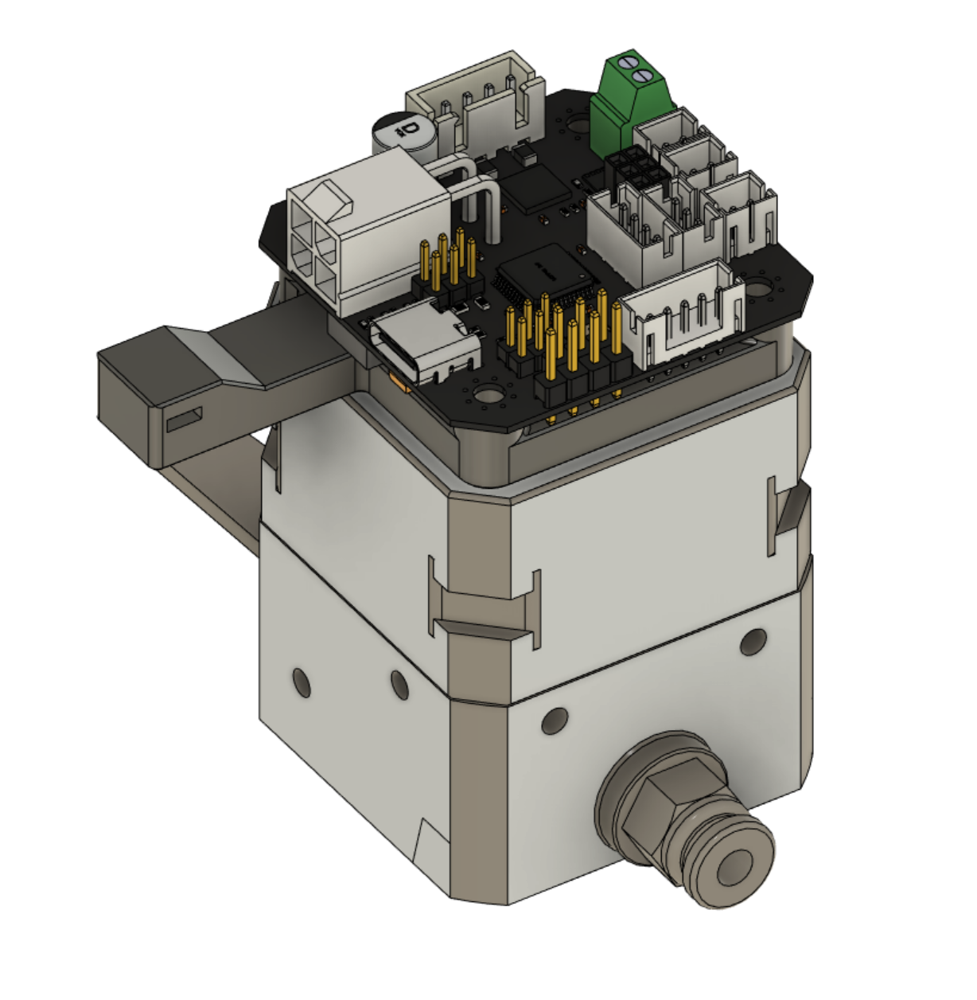

# 42 CAN Adapter for NEMA17 Motor
To be used with Fly SHT42 or Biqu EBB42 to mount behind a NEMA17 stepper motor.

## BOM
- 4x M3x30 SHCS
- SHT42 or EBB42 CAN controller.

## Application
Below is the example installing the EBB42 behind a LGX extruder. 

