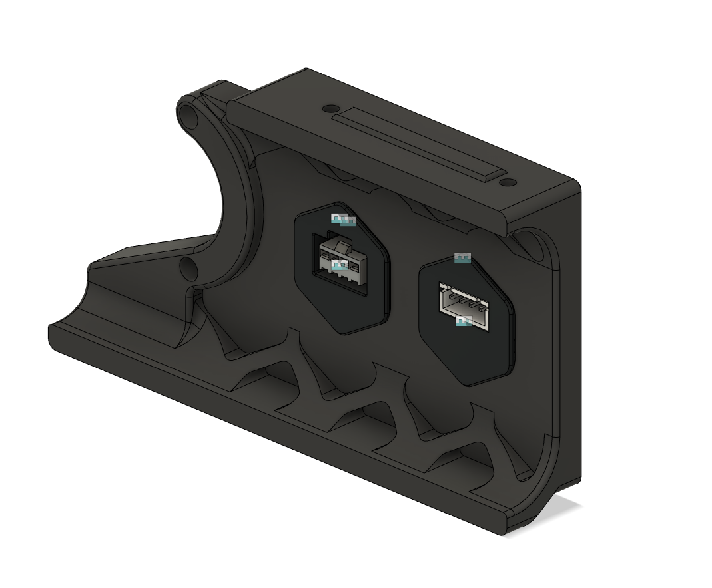
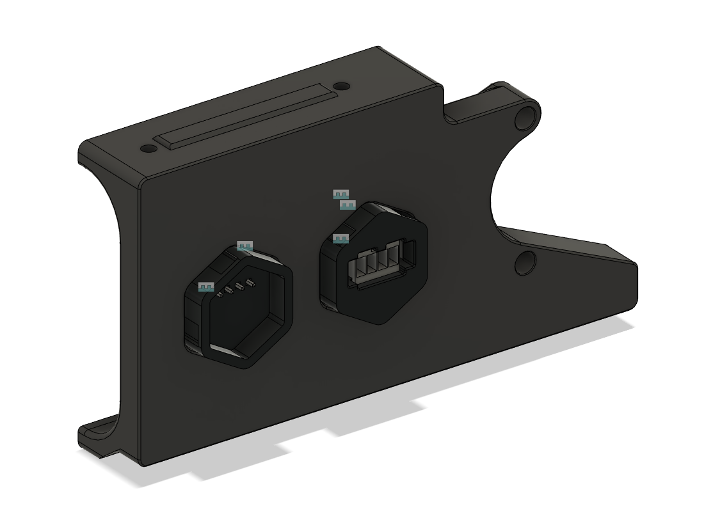

Rear button skirt and skirt buttons
===========

The rear skirt (250mm) that replaces the Keystone skirt providing extra scalability for Voron 250mm printer. The skirt comes with two buttons. The JST XHP is for external motor, for example the secondary inline extruder. The JST SM is designed to extend the CAN connection to the external, for example the ERCF project.
