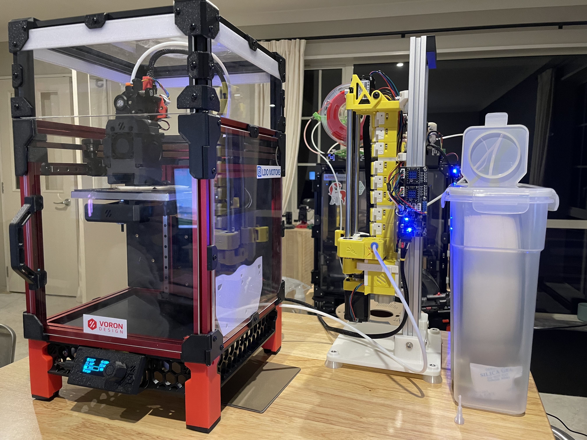
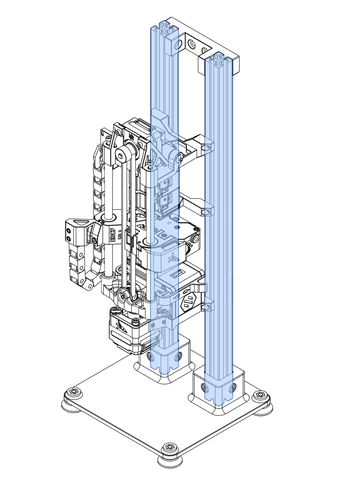
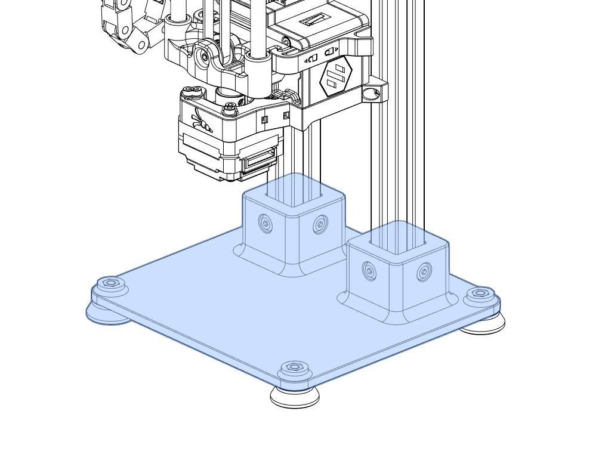
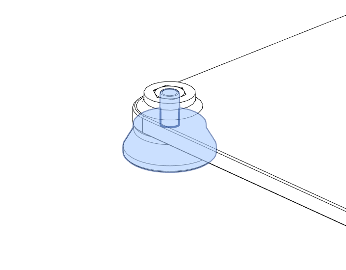
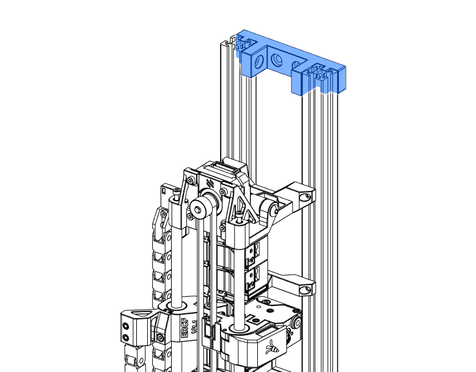

# ERCF Vertical Extrusion Stand
The ERCF Vertical Extrusion Stand is designed for the printer, for example, Voron 0.2 that doesn't have physical space to mount the ERCF. The Vertical Extrusion Stand allows ERCF to operate like a standalone unit. The CAN is strongly reconneded to keep the wiring harness clean and tidy. 

# Components
## Extrusion

The length of the extrusion is subjective. For 9 colour ERCF the 420mm 2020 extrusion is recommended. 

### BOM
* 2x 2020 Extrusion
* 8x M3 T-Block Nuts (or Roll-in T nuts)
* 8x M3x8 SHCS

## Base

The base can be printed in any material. It is recommended to print in PLA or PETG to avoid warping due to the shrinking 
of thermal plastic if printed in ABS or similar material. 

### BOM
* 8x M5x12 SHCS/BHCS
* 8x M5 T-Block Nuts (or Roll-in T nuts)
* 4x M5 hex nuts

## Feet

Feets are designed to be printed in TPU-95A. It is recommended to print with 4x perimeter, 5x top and bottom layers and 
30% infill with gyroid pattern. 

### BOM
* 4x M5x12 SHCS/BHCS

## Side Mounting Block

The side mounting block is taken from the [ERCF side mounting project](https://github.com/eamars/VoronPrinterMods/tree/main/ercf_frame_mount_adapter)
to be installed on the other side of the extrusion to fix the loose end in place. 

### BOM
For each side mounting block you will need
* 2x M5 T-Block Nuts (or Roll-in T nuts)
* 2x M5x10 SHCS/BHCS

