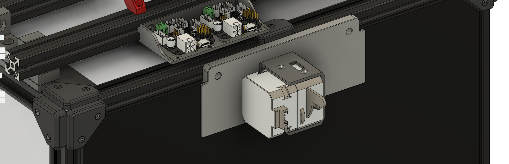

# Exhaust Cover Extruder Mount for LGX
Replaces the rear exhaust with LGX acting as the bowden extruder. It can also be used as the secondary inline extruder helping to 
pull filament from the spool. 

