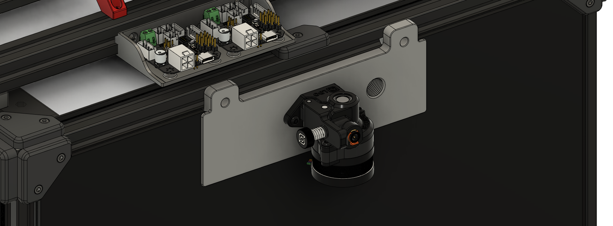

# Exhaust Cover Extruder Mount for Orbiter
Replaces the rear exhaust with Orbiter acting as the bowden extruder. It can also be used as the secondary inline extruder helping to 
pull filament from the spool. 

There are two version: standard and PG7. The PG7 has an additional thread to the plate so the PG7 cable gland can be installed
to guide the toolhead umbilical to the rear. The PG7 version is shown below. 

