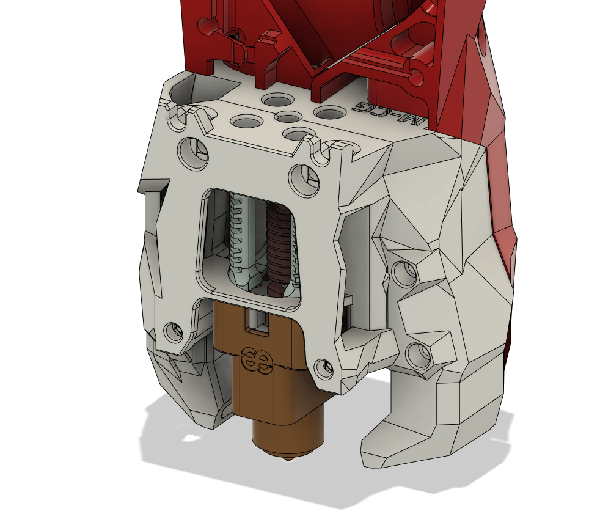

# Stealthburner (RC1) Dragon UHF Fan Duct
The Stealthburner Dragon UHF Fan Duct is built based on [CrazyDragon](https://github.com/eamars/VoronPrinterMods/tree/main/stealthburner_crazy_dragon_toolhead) 
fan duct but elongated by 8.5mm to accommodate the longer Dragon UHF hotend.  

The duct is designed to work with Phaetus Dragon UHF, or any Dragon Volcano with flow extension nut. 

# Other Printed Parts
The rear mounting piece is cross compatible with the [CrazyDragon](https://github.com/eamars/VoronPrinterMods/blob/main/stealthburner_crazy_dragon_toolhead/STL/SBCrazyDragon%20TH%20Rear.stl). 

The Stealthburner front is adopted from [Stealthburner for Rapido UHF](https://github.com/VoronDesign/VoronUsers/tree/master/printer_mods/bythorsthunder/Stealthburner_Rapido_Uhf)

## Print Parameters

Print in standard Voron settings. 

## Previews
---

