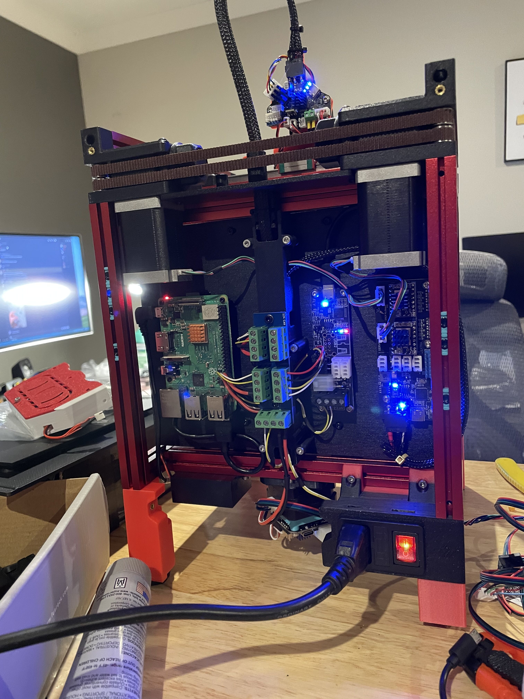
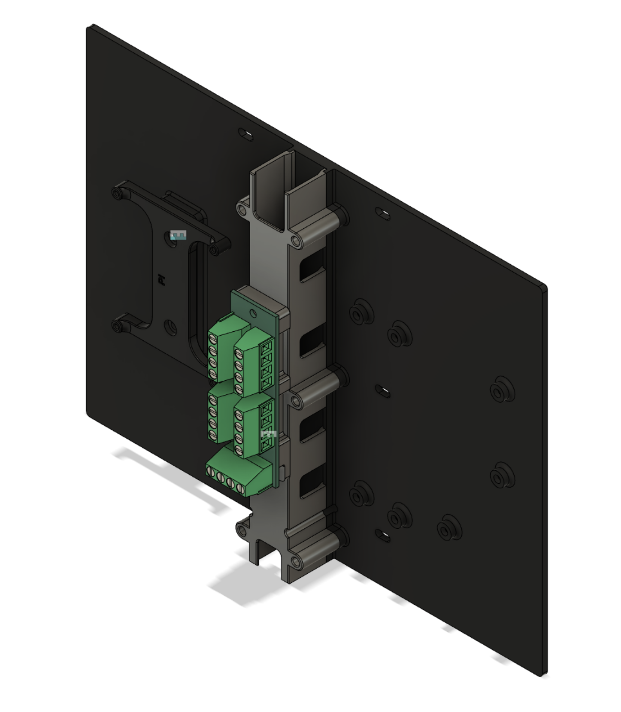

# V0 Printed Mid Panel
The idea is to rigid mount all electronics without using the VHB. The design uses CAN board wherever possible.  

## BOM
- 15x M3x4x5 heatset inserts
- 1x Raspberry Pi
- 1x [1to4 CAN expansion hub](https://github.com/eamars/can_expansion_hub)
- 1x Fly ERCF Board (with 2x stepper motor driver you like)
- 1x Fly UTOC-1
- 4x M2x10 self tapping (for Rasperry Pi)
- 7x M3x8 BHCS (For UTOC-1 and ERCF board)
- 6x M3x25 SHCS (For cable channel)
- 4x M3x8 SHCS (For 1to4 CAN expansion hub and Raspberry Pi mount)
